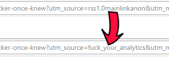

# fya
A Google Chrome extension that changes "utm_source" in URLs to something else.
  
##How?
This extension works through the magic of regular expressions, matching "utm_source" and replacing its value with "fuck_your_analytics".  
Classy, I know.

## Why?
Because I don't like analytics, and I wanted to see what writing Chrome extensions feels like.  
Future versions *might* include totally removing tracking URLs, matching various parameters or replacing their values with something random every time.

##What does it look like?

##Installing
1. Open [chrome://extensions/](chrome://extensions/) 
2. Check the "Developer mode" checkbox
3. Click "Load unpacked extension..."
4. Navigate to the extension's directory and click "OK"
5. That's it.